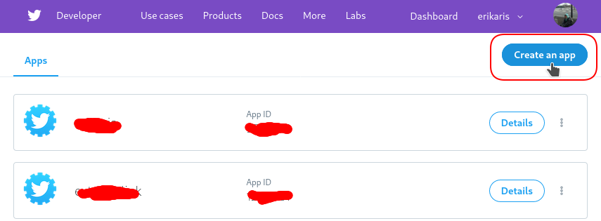
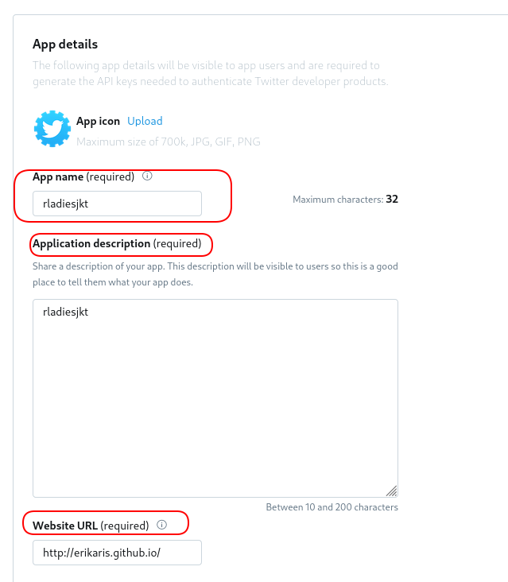
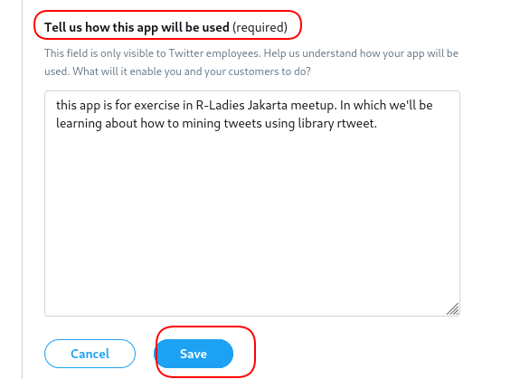

# Preparation for R-Ladies Jakarta 8th Meetup

It's strongly encouraged that you already have a Twitter Account in order to be able to follow the meetup material. If you do not have a Twitter account, please create one and follow @rladiesjakarta and @rladiesbogor :)

## Setting Up Your Twitter Account
1. Login to [developer.twitter.com](https://developer.twitter.com/en/apps) using your Twitter credentials (user name and password). 
2. Create new app to obtain keys and tokens. 

3. Fill up all the required fields. 



## Installing the Required Libraries
```
install.packages('rtweet')
```


